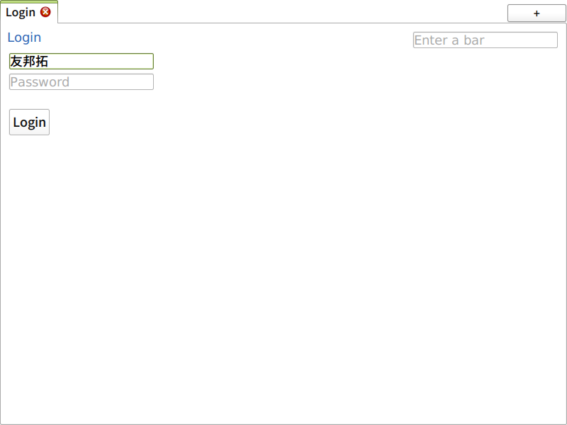
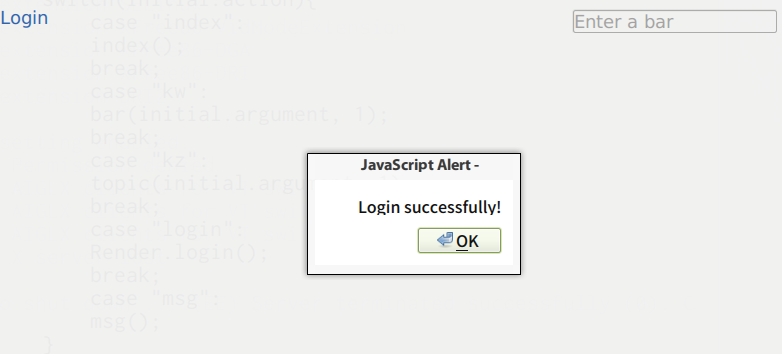
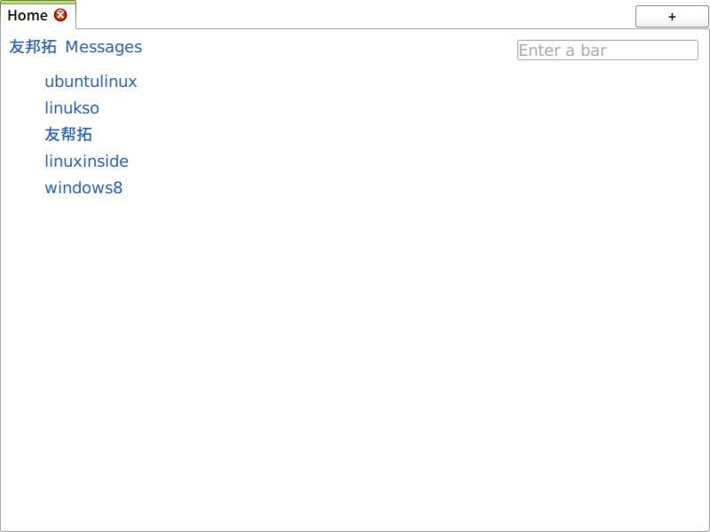
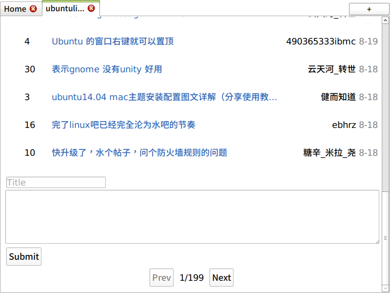
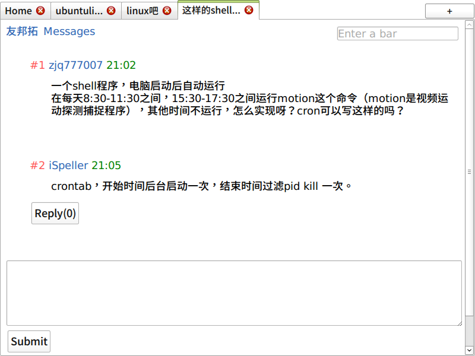

# 大銻貼吧客戶端

以手機貼吧極速版為基礎的一個貼吧客戶端，結構為<code>QtWebKit Bridge</code>，支持'''多開多帳號'''，不存留 Cookie。

當前的版本（實現/實作）'''屬於練習和實驗品的範疇，並不是合適的實現方式'''，但基本功能大多已經實現。若您有興趣基於此開發第三方貼吧客戶端，請考慮'''純圖形庫'''來實現或直接使用 '''GM 腳本''' 對手機貼吧進行「改造」。

樣式目前沒有進行任何精細調整。部分功能可能因為百度的調整或 BUG 而失效。

## 編譯及運行

<pre>
$ git clone https://github.com/910JQK/Stibium
$ qmake    #arch:qmake-qt4
$ make
$ ./Stibium
</pre>

## 使用指南

開啓程式後程式會請求<code>wapp.baidu.com</code>，確認收到應答後會顯示 Login 鏈接，即可登入。登入後再點擊該鏈接 (內容已變成 ID) 即可登出。不登錄也可以從右上角的輸入框輸入吧名，回車。注意加號請換成「%2B」，這樣才能正常進入，例如「C++」=>「C%2B%2B」，而且可能不能發貼，這是百度的一個 BUG。貼子列表右端為最後回覆者而不是發貼者。右鍵 Reload 刷新，Inspect 查看元素可以打開 Inspector 來 Debug, 可以用來看程式有沒有出錯以及網路狀況。

## 成果

- 登入百度：向 http://wappass.baidu.com/passport/login 發送 POST 請求，必須參數為<code>username</code><code>password</code>，還可能有<code>verifycode</code>
- 登出：(GET) http://wappass.baidu.com/passport/?logout
- 貼吧：(GET) http://tieba.baidu.com/mo/m 必須參數<code>kw</code>(keyword) 為吧名
- 帖子：(GET) http://tieba.baidu.com/mo/m 必須參數<code>kz</code>為帖子號碼。可以添加<code>&global=1&expand=樓層</code>來展開被分段的長樓層
- 樓中樓：(GET) http://tieba.baidu.com/mo/m/flr 必須參數<code>kz</code>和樓層的<code>pid</code>(POST ID)，可以從帖子中樓層的回覆鏈接中找到
- 以上三項均有可選參數<code>pnum</code>(Page number)，條目元素<code>div.i</code>
- 回覆我的：(GET) http://tieba.baidu.com/mo/m/replyme
- Ａｔ我的：(GET) http://tieba.baidu.com/mo/m/atme
- 喜歡的吧：(GET) http://tieba.baidu.com/mo/m?tn=bdFBW&tab=favorite
- 發表帖子/回覆：(POST) http://tieba.baidu.com/mo/m/submit 已知參數<code>co</code>(Content) 為帖子內容，<code>ti</code>(Title) 為帖子標題。在頁面的回覆出有對應的<code>input[type="hidden"]</code>，含有相應的定位參數
- 來自 m.tiebaimg.com 的圖片可以指定參數<code>quality</code>(最大值似乎是100) 和<code>size</code>格式是<code>b寬_高</code>
